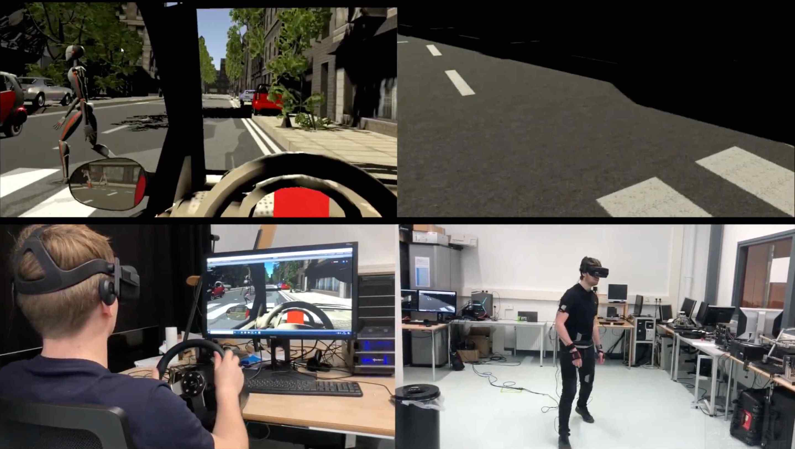

# Evasive manoeuvre 

Based on the open-source [coupled sim](https://github.com/bazilinskyy/coupled-sim). We welcome forking of this repository, pull requests, and any contributions in the spirit of open science and open-source code 😍😄 For enquiries about collaboration, you may contact p.bazilinskyy@tue.nl.

### Citation
If you use results of the experiment conducted with the setup for academic work please cite the following paper:

> Bazilinskyy, P., Kooijman, L., Dodou, D., Mallant, K. P. T., Roosens, V. E. R., Middelweerd, M. D. L. M., Overbeek, L. D., & De Winter, J. C. F. (2022). Get out of the way! Examining eHMIs in critical driver-pedestrian encounters in a coupled simulator. Available at [https://www.researchgate.net/publication/360237527_Get_out_of_the_way_Examining_eHMIs_in_critical_driver-pedestrian_encounters_in_a_coupled_simulator](https://www.researchgate.net/publication/360237527_Get_out_of_the_way_Examining_eHMIs_in_critical_driver-pedestrian_encounters_in_a_coupled_simulator)

## Description of the experiment
:tv: The image below points to a youtube video of the recording of a demo of the experimental setup:

Additionally, there are three more videos which demonstrate the setup:
1. Split-screen demo [https://www.youtube.com/watch?v=Pw5WHGpkbPI](https://www.youtube.com/watch?v=Pw5WHGpkbPI)
2. Top-view [https://www.youtube.com/watch?v=fOHLv7fJorg](https://www.youtube.com/watch?v=fOHLv7fJorg)
3. Top-view [https://www.youtube.com/watch?v=wMN_nvb5wqQ](https://www.youtube.com/watch?v=wMN_nvb5wqQ)

This study examines a new application of eHMIs, namely the provision of direction information to pedestrians in scenarios where the pedestrian is almost hit by a car. In an experiment, car drivers and pedestrians interacted in the same virtual world, where the pedestrian had to cross the road as the car driver approached. The results showed that the directional eHMI caused pedestrians to step back and produced a tendency towards fewer crashes compared to no eHMI. The eHMI increased the pedestrians’ self-reported understanding of what the car was going to do, although some pedestrians did not notice the eHMI.

## How to run
Check instructions at the repo of the [coupled sim](https://github.com/bazilinskyy/coupled-sim#how-to-run).